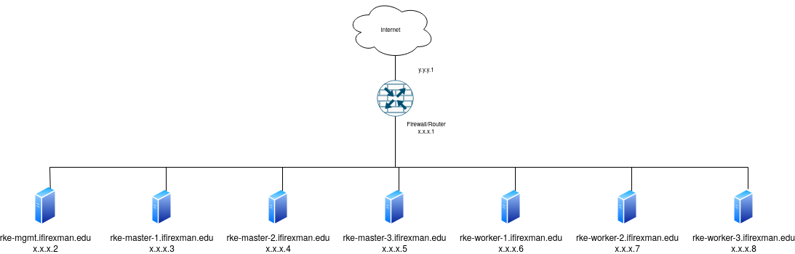

# iFIRExMAN Training Programme

## Overview

This repository provides step-by-step guides on setting up Identity Federation core services and IdP-as-a-Service:

- [Kubernetes cluster](guides/rke.md).

- [MariaDB Database](guides/mariadb.md).

- [Federation core services](guides/federationcore.md).

- [SSO Test Service](guides/ssotest.md).

- [Shibboleth Identity Provider (IdP)](guides/idp.md).

## Architecture

### Infrastructure

- The infrastructure is based on a typical Kubernetes cluster setup where you need to prepare several master and worker nodes.

- Optionally, you can also prepare a node that serves as a management (or login) node used to setup and manage your Kubernetes cluster and IdP-as-a-Service.

- These nodes do not necessarily need a public IP address. Instead, a private IP address is sufficient.

- 1:1 NAT will be used for incoming traffic from the internet.

- Seven (7) virtual machines are required for the infrastructure:

  - **RKE-MGMT (Management Node)**
    - 1 VM (4 vCPUs, 8GB RAM, 25GB Storage, Rocky Linux 8.6)
  - **RKE-MASTER (Master Node)**
    - 3 VM (4 vCPUs, 8GB RAM, 25GB Storage, Rocky Linux 8.6)
  - **RKE-WORKER (Worker Node)**
    - 3 VM (>=8 vCPUs, >=16GB RAM, 50GB Storage, 100GB Data, Rocky Linux 8.6)

- Rocky Linux should be installed minimally (without GUI) on all nodes.

- The storage for the OS and Data (in the case of RKE-WORKER) should be on separate virtual disks.

- Root access to all nodes are required.

### Networking

- Referring to the **iFIRExMAN Architecture** diagram, `x.x.x` denotes the private IP subnet, while `y.y.y` denotes the public IP subnet.

- A static private IP address is required for each node.

- You need to prepare 2 public IP and 2 private IP addresses and establish a 1:1 NAT between them.

- Access to ports 80 and 443 for both the public IP addresses are required.

- Several sub-domain names are required and should be pointed to the first public and private IP addresses at your external and internal DNS servers. These sub-domain names are:

  - `fedmanager.ifirexman.edu`
  - `ds.ifirexman.edu`
  - `mdq.ifirexman.edu`

- Replace `ifirexman.edu` with your own domain name.

- If you are currently already operating an Identity Federation, you may skip creating sub-domain names for `fedmanager` and `ds` and use the existing ones. However, you will still need to setup the `mdq` sub-domain name.
